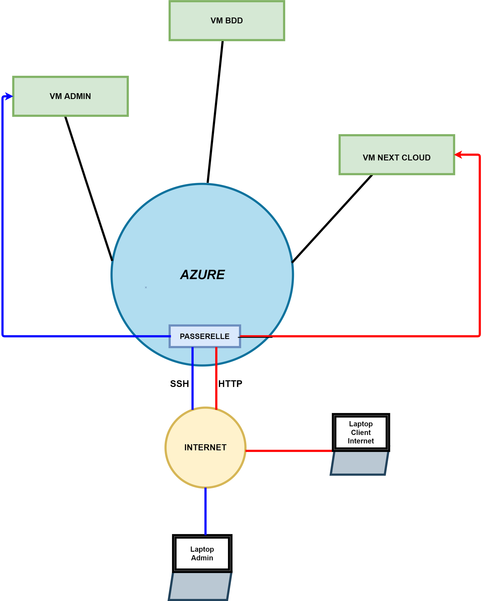

# 1- Présentation de l'infrastructure   
L'infrastructure doit être composée de trois VM. Elle sera déployé en utilisant la solution AZURE CLOUD  
1. VM d'administration qui doit être accessile depuis l'extérieur.  
Elle sert de rebond pour pouvoir : administrer les 2 autres VM.
1. VM applicative : elle héberge l'application "Nextcloud", elle est reliée à la VM qui héberge le serveur base de données. 
2. La VM Base de données : elle distribue son service à destination de la VM applicative.  

L'infrastructure sera déployé sur le réseau 10.0.2.0/24

# 2- Description des éléments de l'infrastructure  

  ## a) Topologie réseau  

  
  ## b) table d'adressage ip  
  |nom de la VM|ip privée|ip public| Fonction |
  |------------|---------|---------|----------|
  |Ls2-admin| 10.0.2.10| 20.231.84.180 | Administration |
  |LifeNC-grp2 | 10.0.2.11 |  20.106.150.0 | NextCloud |
  |LifeBDD | 10.0.2.12 | ---- | SGBDR |
    
  |Passerelle | ip privée | DNS |
  |-----------|-----------|-----|
  | fournit par azure| 10.0.2.1| 168.63.129.16|
  
  ## c) les VM
  (vérifier le thin provisionning de AZURE STACK HCI)

  ### d) VM administration  
  ||Ls-grp2-admin||
  |---|---|-------|
  | OS |Débian 11 "bullseye"|
  |HDD| 30 Go| |
  |CPU| 2 | |
  | RAM | 8 Go | |
  | Filesystem| ext4 | |
  
  ### e) VM Nextcloud  
  ||LifeNC-grp2||
  |---|---|-------|
  | OS |Débian 11 "bullseye"|
  |HDD| 30 Go| |
  |CPU| 2 | |
  | RAM | 8 Go | |
  | Filesystem| ext4 | |
  | soft 1 | Apache V 2.4 | serveur web |
  | soft 2| NextCloud | |
  
  ### f) VM SGBDR  
  ||LifeBDD||
  |---|---|-------|
  | OS |Débian 11 "bullseye"|
  |HDD| 30 Go| |
  |CPU| 2 | |
  | RAM | 8 Go | |
  | Filesystem| ext4 | |
  | soft 1| Postgresql | SGBR |
  
  ## g) Liste des ressources AZURE  
  1. créer le groupe de ressource  
  2. créer le réseau virtuel
   2.1 définir la plage d'adressage selon le réseau 10.0.2.0/24 ( ne pas oublier de supprimer la plage d'adressage par défaut de AZURE pour éviter le cheveauchement)
  3. création de la VM admin selon spécification ci-dessus 
  4. création de la VM BDD selon spécification ci-dessus avec déployement Postgresql
  5. création de la VM NextCloud selon spécification ci-dessus, installation Apache v 2.4, installation Nextcloud
  6. mise en place des règles de routage ( HTTP par le port 1080, SSH part le port 1022)

 # 3- Création des clés ssh   
 Lancer Windows PowerShell et taper la commande :  
 `sudo ssh-keygen`  
 Enregistrer la clé dans un sous-dossier du répertoire utilisateur nommé `.ssh`

# 4 - Installation paramétrages

## 4.1 - Installation de `ls2-admin`

### Ajouter sa clé publique sur la machine virtuelle
`ssh-copy-id grp2@20.25.9.8`

## 4.2 - Installation de `ls2-BDD`

### a) Installation de PostgreSQL
`sudo apt update`
`sudo apt install postgresql postgresql-contrib`

### b) Création de l'utilisateur "nextcloud"
`sudo su - postgres psql`   
`postgres=> ALTER ROLE nextcloud WITH PASSWORD Lifesense123;`  
`postgres=> CREATE DATABASE nextclouddb;`  
`postgres=> GANT ALL PRIVILEGES ON DATABASE nextclouddb TO nextcloud;` 

## 4.3 - Installation de `l2-NC`

### a) Installation d'Apache
`sudo apt-get install apache2`
Changer le port d'écoute en 8080 : `vim /etc/apache2/ports.conf`  
Dans vim, modofier la ligne : `Listen 80`en `Listen 8080`

### b) Installation de PHP
`sudo apt -y install php php-common php-zip php-gd php-mbstring php-curl php-xml php-pgsql`

`sudo systemctl restart apache2`

### c) Installation de Nextcloud
* 1 -  Supprimer le dossier `/var/www/html`  
* 2 - Aller dans /var/www/ et y télécharger nextcloud 
`apt-get https://download.nextcloud.com/server/releases/latest.tar.bz2`  
* 3 - Une fois l'archive téléchargée, l'extraire : `tar xvf ./latest.tar.bz2`  
Renommer le nouveau dossier `nextcloud` en `html` avec la commande `mv nextcloud html`  
* 4 - Redéfinir les droits utilisateurs avec la commande `chmod 777 -R`  
* 5 - Modifier la configuration de nextcloud : `vim /var/www/html/conf/config.php`  
* 6 - Modifier le trust domain : dans le tableau mettre `0=> '20.120.12.97:8080`  
* 7 - Redémarrer apache : `systemctl restart apache2` puis vérifier qu'apache est actif `systemctl status apache2`
 
configuration des ports et autorisations réseau  
pghba liste des users et quelle ip  
postgres.conf * 0.0.0.0 
 
  
    
